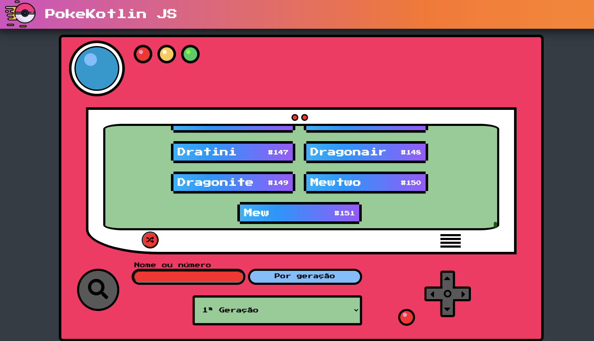
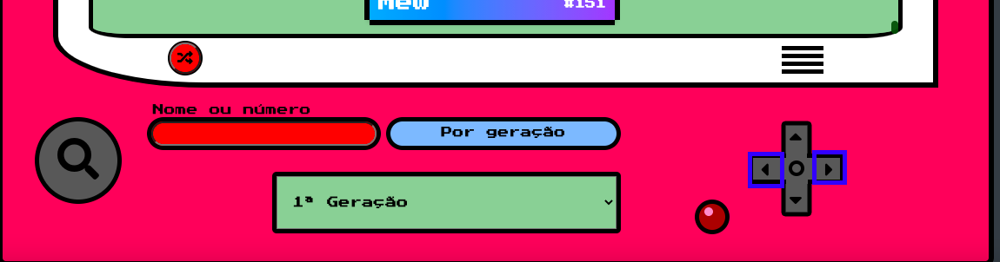
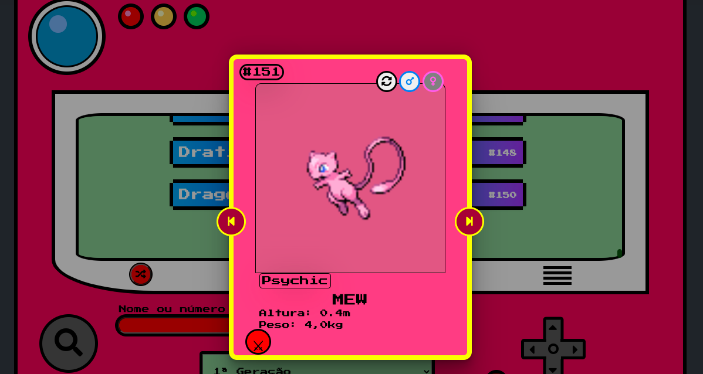

# PokeKotlin JS

PokeKotlin JS is an online pokedex

## About

- PokeKotlin JS was made respecting the functional programming paradigms.
- The website does not contain any advertisements or use of internal or external storage (cookie or location)
- The API used: [PokeApi](https://pokeapi.co/)

## Guide

#### The first list shown is from the 1st generation of Pokémon, from 1 to 151



#### To list other generations just select the generation of your choice and click on the search button


#### To see by type of pokemon just click on the Right or Left buttons.



#### To find a especific pokemon just search right here.


#### To randomize a pokemon just click right here.


#### To see more about a specific Pokémon, just click on the chosen Pokémon card.



## Settings

- To build the project, you need to have Kotlin installed on your machine, and execute the command:

```cmd

kotlinc-js $ <-output js / $ @

```

- If you don't have Kotlin installed, PokeKotlin has storage in [Repl.it](https://replit.com/@zDeemon/PokeKotlin), and to build the project just click on the 'Run' button

### ToDo:

- [ ] In pokemon card: stats, weakness, evolutions, egg types and formate
- [ ] A button to complementing inverse
- [ ] Add mesage to "not found"
